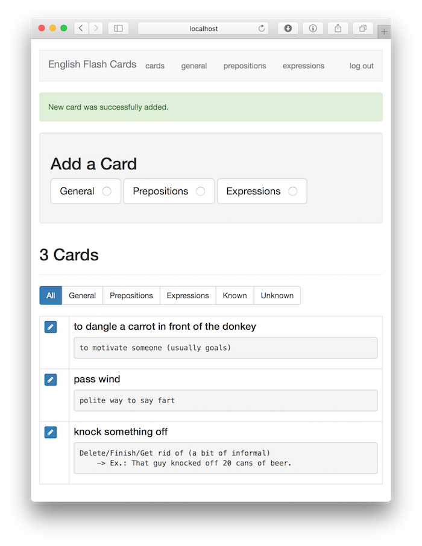
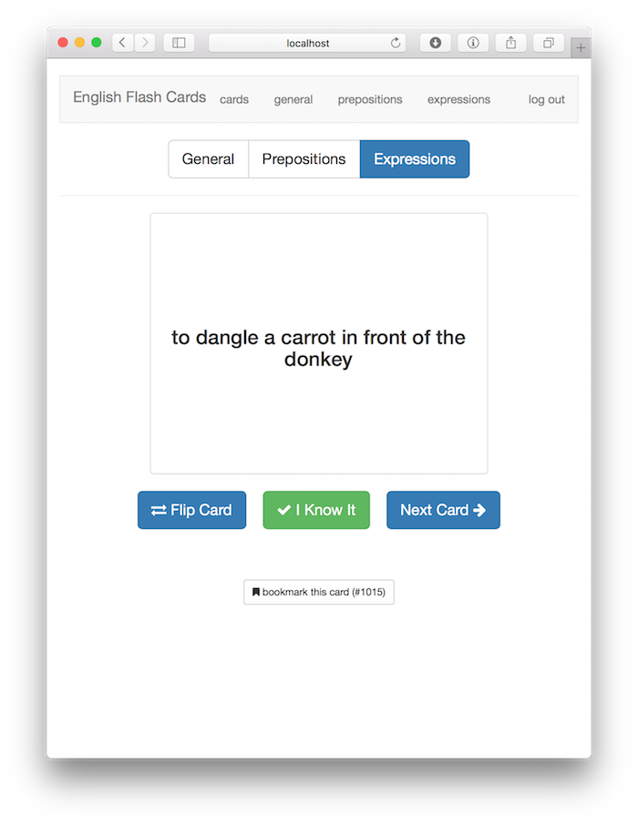
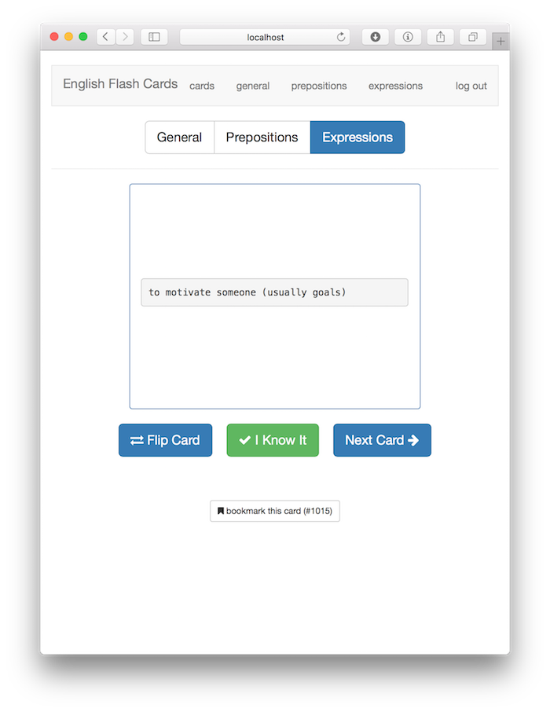

# English Flash Cards

This code was originally written by [@jwasham](https://github.com/jwasham) among other [contributors](https://github.com/jwasham/computer-science-flash-cards/graphs/contributors). I modified according to my needs and built deployment automation scripts to make it easier for future developers/users.

This is a little website that allows ESL learners (me included) to easily make flash cards and quiz themselves for memorization of:

- general english knowledge
    - vocabulary
    - prepositions
    - expressions

Will be able to use it on:
    - desktop
    - mobile (phone and tablet)

It uses:
- Python 3
- Flask
- SQLite

---

## Screenshots

UI for listing cards. From here you can add and edit cards.

---

The front of a General flash card.

---

The reverse (answer side) of a expression flash card.

## How to run with Docker

*Provided by [@Tinpee](https://github.com/tinpee) - tinpee.dev@gmail.com - Reach out to this contributor if you have trouble.*

__Make sure you already installed [docker](https://www.docker.com)__

1. Clone project to any where you want and go to source folder.
1. Edit the config.txt file. Change the secret key, username and password. The username and password will be the login 
    for your site. There is only one user - you.
1. Build image: `docker build . -t english-flash-cards`
1. Run container: `docker run -d -p 8000:8000 --name english-flash-cards english-flash-cards`
1. Go your browser and type `http://localhost:8000`

__If you already had a backup file `cards.db`. Run following command:__
*Note: We don't need to rebuild image, just delete old container if you already built.*
`docker run -d -p 8000:8000 --name english-flash-cards -v :<path_to_folder_contains_cards_db>:/src/db english-flash-cards`.
`<path_to_folder_contains_cards_db>`: is the full path contains `cards.db`.
Example: `/home/tinpee/english-flash-cards/db`, and `cards.db` is inside this folder.

For convenience, if you don't have `cards.db`, this container will auto copy a new one from `cards-empty.db`.

---

### How to backup data ?
We just need store `cards.db` file, and don't need any sql command.
- If you run container with `-v <folder_db>:/src/db` just go to `folder_db` and store `cards.db` anywhere you want.
- Without `-v flag`. Type: `docker cp <name_of_container>:/src/db/cards.db /path/to/save`

### How to restore data ?
- Delete old container (not image): `docker rm cs-flash-cards`
- Build a new one with `-v flag`:
`docker run -d -p 8000:8000 --name english-flash-cards -v <path_to_folder_contains_cards_db>:/src/db cs-flash-cards`
- Voila :)

*Happy learning!*

